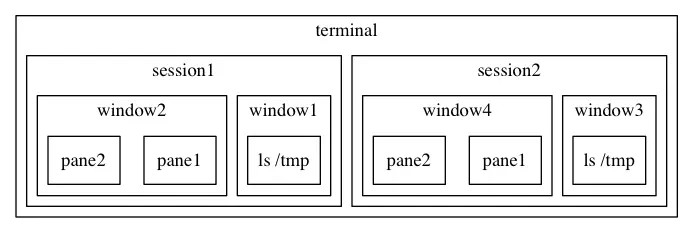
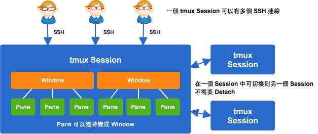
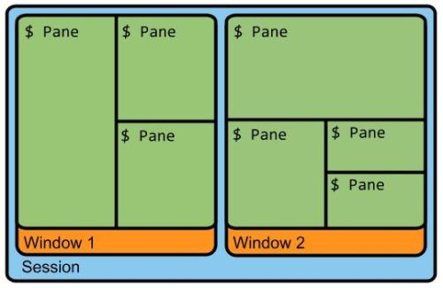
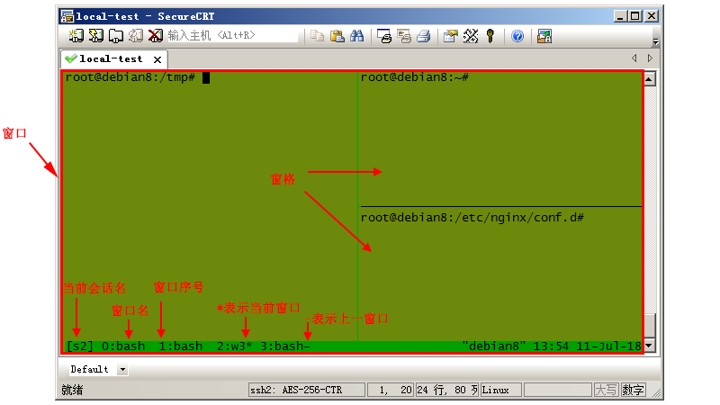
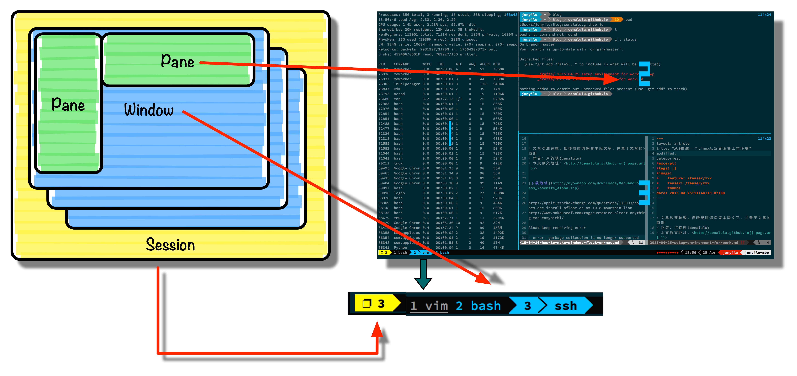

# tmux

tmux 配置文件

** tmux 中所有的快捷键都需要和前缀快捷键 ctrl + b  来组合使用 **

---

 

窗格操作

* c 新建窗口，此时当前窗口会切换至新窗口，不影响原有窗口的状态
* p 切换至上一窗口
* n 切换至下一窗口
* w 窗口列表选择，注意 macOS 下使用 ⌃p 和 ⌃n 进行上下选择
* & 关闭当前窗口
* , 重命名窗口，可以使用中文，重命名后能在 tmux 状态栏更快速的识别窗口 id
* 0 切换至 0 号窗口，使用其他数字 id 切换至对应窗口
* f 根据窗口名搜索选择窗口，可模糊匹配

* % 左右平分出两个Pane
* " 上下平分出两个Pane
* x 关闭当前Pane
* { 当前Pane前移
* } 当前Pane后移

* ; 选择上次使用的窗格
* o 选择下一个窗格，也可以使用上下左右方向键来选择
* space 切换窗格布局，tmux 内置了五种窗格布局，也可以通过 ⌥1  至 ⌥5来切换
* z 最大化当前窗格，再次执行可恢复原来大小
* q 显示所有窗格的序号，在序号出现期间按下对应的数字，即可跳转至对应的窗格

---
